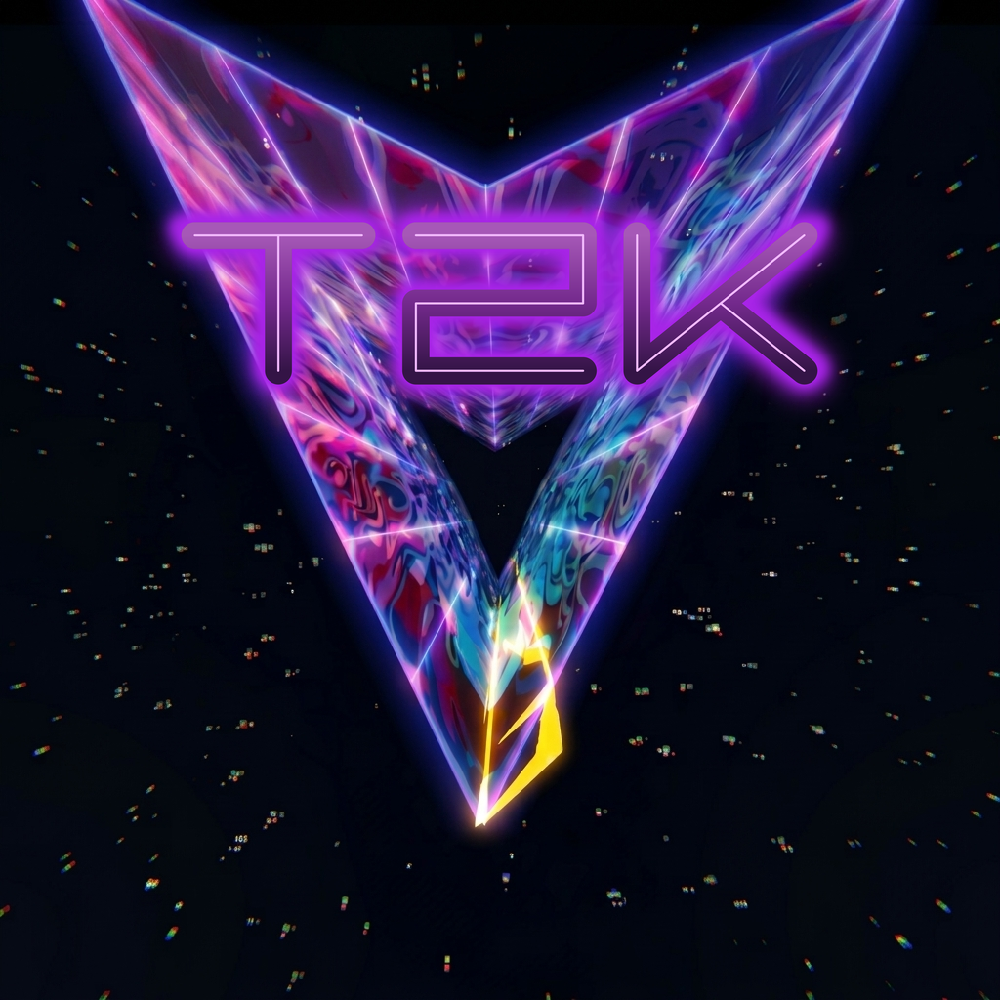

# T2K: Psychedelic Tube Shooter

A Tempest 2000-inspired tube shooter built around the Nintendo 3DS's stereoscopic screen. The web recedes into the display, enemies race up its lanes, and the geometry, particles, and glow are rendered for two eyes from the start. The desktop code also includes a Vulkan renderer and an OpenXR stereo path.



## Download and play

- **3DS:** Browse the [CIA download](https://archive.org/details/t2k-3ds), or open the Reddit post and swipe to its QR code for FBI.
- **Performance in stereoscopic 3D:** approximately 25–30 fps on Old 3DS and 50–60 fps on New 3DS.
- **Build from source:** see [Building from scratch](#building-from-scratch). The linked prebuilt download is for 3DS.

## The game

Tempest 2000 has always been about depth: a web opening away from you, lanes rushing up the tube, everything lit like neon. T2K rebuilds that feeling for the 3DS's 3D screen. Its visual direction draws on sacred geometry and psychedelia: symmetry, color, and motion pulse with the music.

The bottom screen is a jukebox, with albums from Tempest 2000, Tempest 3000, Tempest 4000, TxK, and Space Giraffe. Play an album or pick individual tracks; the music can also advance as you move through the levels. Tap the dark bottom screen to wake the deck.

The web, plasma, wireframe glow, explosions, particles, and feedback effects were tuned for stereoscopic 3D rather than converted from a 2D presentation.

## Sound that drives the picture

- Tracker (MOD) music uses a clean-room ProTracker replayer, streamed as mono 16-bit PCM at 44.1 kHz through ndsp on a worker thread pinned to a spare CPU core.
- A real-time audio analyzer drives the star tunnel, a subtle bass-triggered change in web color, and a level select that moves with the beat. The FFT reuses samples already computed by the DSP-ADPCM decoder. A photosensitivity option limits the strength and speed of visual pulses.
- The published CIA bundles multiple DSP-compressed albums in romfs. Builds without third-party audio are also supported; see [Audio sources and rights](#audio-sources-and-rights).

## Gameplay

- 100 unique levels
- **The full arcade roster:** Flipper, Tanker and its variants, Spiker, Fuseball, Pulsar, Mirror, Adroid, and Reflector.
- **Powerups and bonuses:** An eight-slot ladder covers laser, jump, tremor, droid, and superzapper, with a warp token and a few surprises. Warp bonus rounds are included.
- **Camera:** Classic and auto-framing modes (SELECT), adjustable field of view, and C-Stick zoom on New 3DS.

## Controls

| Action | Button |
|---|---|
| Move claw | D-Pad ← / → or Circle Pad |
| Shoot | A |
| Jump | B |
| Tremor (web pulse) | X |
| Superzapper | Y |
| Pause / menu | START |
| Cycle camera viewpoint | SELECT |
| FOV zoom | C-Stick (New 3DS) |
| Music / jukebox deck | Touch (bottom screen) |

SELECT only changes the camera viewpoint. The bottom screen stays dark until you tap it to wake the jukebox.

## Shared technology

The 3DS and desktop targets share one simulation core. The engine's boundaries reflect the 3DS's hardware constraints.

- **One renderer interface, two GPU backends.** The flat C API in `t2k_core/src/rendering/render.h` uses free functions and opaque `void*` handles. Shared game code never sees a `GLuint` or `C3D_Tex`. The target selects its backend at build time, without a virtual renderer in the hot path.
- **Data-oriented C++.** Aggregate structs and free functions avoid virtual dispatch, RTTI, and exceptions in hot paths. The same simulation compiles for desktop Vulkan and the 3DS without conditional compilation removing gameplay.
- **Shared audio core.** A clean-room ProTracker MOD replayer, a DSP-ADPCM decoder, the FFT analyser, and the SFX bank live in `t2k_core/src/audio/`; each target only supplies the output sink.
- **Controlled allocation and error handling.** The code builds with `-fno-exceptions -fno-rtti`. JSON config and high scores use nlohmann's exception-free API. Per-frame, per-entity, and per-particle loops avoid STL heap growth; fixed arrays are sized from `constants.h`. Packed asset reads use an unaligned-access shim on ARM11.

## 3DS

The 3DS is the performance target and the reference for what the game contains. The hardware's limits are the reason the engine is shaped the way it is.

### PICA200 graphics engineering

The 3DS GPU has no programmable pixel shader, only six fixed-function combiner stages. T2K uses all six.

- **Six combiner stages at once.** The deepest surface pass chains two textures, tint, distance fog, and additive glow through the GPU's TEV stages.
- **Fog in the combiner.** Distance fade rides on vertex alpha, so there's no extra post pass.
- **Glow without a line primitive.** The PICA200 can't draw lines, so the tube's edge glow is built from billboard quads traced along every edge, per eye, with depth falloff.
- **Low-cost supersampling.** The frame renders oversized, then the display transfer downsamples it for a clean 2× supersample. On-device A/B profiling found little change in GPU time when the supersample was reduced.
- **Procedural textures.** A texture DSL executes on the CPU to RGBA8, then Morton/Z-order tile-swizzles into PICA ABGR8 textures. Level textures are generated on the fly, and a background worker on the second core prepares them ahead of time so levels load quickly.

### GPU vertex animation

- The undulating web **"tremor" wave** is a **static base mesh uploaded once per level** plus a **grid-only picasso vertex shader** that applies the wave displacement (`pos += normal · sin(phase) · tremor · √depth`) and distance fog on the **GPU vertex unit**.
- PICA has no `sin` instruction, so the shader uses a **polynomial approximation** over `[-π, π]` after range reduction (max error 0.0011, exact at 0/±π/2/±π — sub-pixel).
- The wave is bound **only** for the grid draw and restored afterward, so entities/HUD never wave.

### On-device performance work

- On-device profiling (`svcGetSystemTick`, one line / 60 frames to an FTP-pullable SD log) split into **CPU build vs. GPU wait**, with the build hoisted **before `C3D_FrameBegin(SYNCDRAW)`** so it overlaps the previous frame's GPU work (software pipelining).
- In A/B tests of many-pass stereo frames, draw submission and state changes dominated GPU time; halving the supersample barely moved it. Supersampling was inexpensive in those tested scenes.
- **Different bottlenecks by model:** The tested New 3DS scenes were GPU-bound; Old 3DS scenes were CPU-bound. Moving the web wave to the GPU mattered most on Old 3DS.
- Plasma trails composited at low res (32×32) to collapse two full-screen additive passes into one.

### Camera & options

- **Auto-framing camera.** Camera distance and offset are derived from the web's measured bounding box, so every playfield shape frames itself instead of inheriting constants tuned for one level. Both modes run through one eased smoother, so switching crossfades rather than snapping.
- **Live Field-of-View control** — a graphics-menu slider (40–75°) and the New 3DS C-stick as a zoom, both applying in real time and persisted to the SD config.
- Web glow, texture brightness, background, and audio album are all adjustable, and your settings are saved — on-SD JSON config under `sdmc:/3ds/t2k/`, with persisted high scores.

## Desktop and VR code

The desktop build runs the same simulation as the 3DS and serves as a host-side correctness reference. The 3DS is the reference for game content; desktop rendering can use different effects. The aesthetic contract is documented in the local-only `docs/DOCTRINE.md`.

- **SDL2 + Vulkan 1.3 renderer** (`t2k_pc/src/rendering/renderer_vk.cpp` + `vk_*.cpp`, GLSL in `shaders/`): SDF vector lines and a bloom pyramid give the glow a softness the PICA200 can only fake with quads.
- **Live procedural textures in fragment shaders.** The same texture-DSL semantics that run on the CPU for the 3DS seethe per-pixel on desktop instead.
- **Multiview stereo for OpenXR.** The engine was built stereoscopic-native for the 3DS, so the VR path projects the same per-eye geometry through a headset instead of retrofitting a 2D game.
- **Host-side checks.** Harnesses use real engine data and matrix semantics to help localize bugs that otherwise appear only on hardware.

## Repository layout

| Path | What |
|---|---|
| `t2k_core/src/game/` | Core simulation (engine, enemies, weapons, collision, player, camera) — platform-agnostic, compiled into both targets |
| `t2k_core/src/rendering/` | The `render.h` / `font.h` seam headers + the shared geometry builders both backends consume |
| `t2k_core/src/audio/` | Shared audio core: ProTracker replayer, DSP-ADPCM decoder, FFT analyser, SFX bank |
| `t2k_core/src/data/` | Save/load (exception-free JSON), level + enemy data; `t2k_core/data/levels.json` is the level list |
| `t2k_core/src/ui/` | Seam-only menus / level select / touch panel (no SDL, no libctru) |
| `t2k_core/tools/` | Level generator + verifier, harnesses, bin2h |
| `t2k_3ds/` | The 3DS target: `Makefile`, `src/platform_3ds/` entry point, `src/rendering/renderer_c3d.cpp` (Citro3D), ndsp audio sinks, `shaders/*.v.pica` |
| `t2k_pc/` | The desktop target: `CMakeLists.txt`, `src/main.cpp` (SDL2), the Vulkan 1.3 renderer (`renderer_vk.cpp` + `vk_*.cpp`, GLSL in `shaders/`), SDL audio sinks |
| `soundtracks/` | The soundtrack pipeline: fetch → decode → DSP-ADPCM encode → album map, pinned by `track_map.json` |
| `docs/` | Local design notes and validation write-ups, including `DOCTRINE.md` (not in the public clone) |
| `tools/` | Build tooling and the vendored DSP-ADPCM encoder (`tools/vendor/`); some gate scripts are local-only |

## Building from scratch

After installing the prerequisites below, run this from a clone:

```
./build.sh
```

The script runs these stages and reports the output path, size, and SHA-256 of `t2k_3ds/t2k.cia`:

| # | Stage | What happens |
|---|---|---|
| 1 | **bootstrap** | checks `git` / `make` / `python3` / `ffmpeg` and devkitARM; installs the pinned Python build deps (`requirements-build.txt`) into the ambient interpreter if it already has them, otherwise into a project-local `.venv`; compiles the vendored DSP-ADPCM encoder into `tools/bin/dspadpcm` |
| 2 | **fetch** | downloads the source FLACs from KHInsider into `soundtracks/<album>/` — resumable, existing files are skipped |
| 3 | **audio** | `ffmpeg` → 32 kHz mono PCM → `dspadpcm` → `soundtracks/dsp/*.dsp`; copies the MOD album through unchanged; writes `dsp/albums.json`; hash-checks every output against `soundtracks/track_map.json`; stages the pool to `data/music/` |
| 4 | **cia** | `make -C t2k_3ds cia` → `t2k_3ds/t2k.cia` |
| 5 | **report** | artifact path, size, SHA-256 |

If the music fetch fails, the build can still finish without the DSP album pool. The embedded MOD tracks and album manifest remain available.

### Targets

| Command | Does |
|---|---|
| `./build.sh` | bootstrap → fetch → audio → CIA |
| `./build.sh bootstrap` | deps + Python env + the vendored encoder, nothing else |
| `./build.sh fetch` | download the source FLACs only |
| `./build.sh audio` | encode the DSP pool + MOD copy + `albums.json` + stage `data/music/` |
| `./build.sh cia` | package the CIA from the current tree (dirty tree OK) |
| `./build.sh production` | the strict, traceable CIA — refuses a dirty tree, always cleans, verifies banner / exheader / SMDH from the built bytes |
| `./build.sh pc` | the desktop oracle (SDL2 + Vulkan 1.3) |
| `./build.sh verify` | hash the built pool against `soundtracks/track_map.json` |
| `./build.sh check` | the repo gate suite (VFP hot-path contract, ARM11 math audit, R11 screen, level/demo audits) |
| `./build.sh clean` | generated pool + staging + build trees (keeps downloaded FLACs and `.venv`) |

### Flags

| Flag | Effect |
|---|---|
| `--no-audio` | build a smaller CIA without third-party audio (`T2K_MUSIC_POOL=none`) |
| `--skip-fetch` | never hit the network; fail if the source FLACs are absent |
| `--venv` | force a project-local `.venv` even if the system interpreter already has the deps (keeps conda/system site-packages out of the build) |
| `--force` | re-encode every track even when it already matches the pinned hash — proves the map still holds under a changed encoder/ffmpeg |

`./build.sh --help` prints this too.

### Prerequisites

- **System:** `git`, `make`, `python3` (3.10+), `ffmpeg`.
- **3DS build:** devkitPro — `devkitARM`, `libctru`, `citro3d`, `picasso`. Read from `$DEVKITPRO` / `$DEVKITARM`, defaulting to `/opt/devkitpro`.
- **Python:** `beautifulsoup4`, `curl_cffi`, `pyflakes` — installed automatically by the bootstrap stage from `requirements-build.txt`.
- **Desktop build only:** CMake ≥ 3.16, SDL2 + SDL2_mixer dev packages, `glslang` on PATH (or `$VULKAN_SDK/bin`), and a Vulkan 1.3 driver at runtime.

## Audio sources and rights

The published CIA includes music from commercial games. Those recordings are separate from the MIT-licensed engine code; the code license does not cover them. The source FLACs and encoded `.dsp` pool are not committed to this repository, but the build script can fetch and encode them. `./build.sh --no-audio` creates a build without third-party audio. Check the rights to any recordings before redistributing a build that contains them.

`soundtracks/track_map.json` pins each pool file's name, album, order, and SHA-256. The DSP-ADPCM encoder is vendored at `tools/vendor/gc-dspadpcm-encode` (MIT). The audio stage verifies encoded outputs against the map.

The five source albums are fetched from KHInsider into `soundtracks/`:

| Album | Folder | KHInsider source |
|---|---|---|
| Tempest 2000 | `tempest2000_soundtrack/` | `tempest-2000-the-soundtrack-1995` (12) |
| Tempest 3000 | `tempest3000_soundtrack/` | `tempest-3000-nuon-gamerip-2000` (19) |
| Tempest 4000 | `tempest4000_soundtrack/` | `tempest-4000-gamerip` (144 → deduped) |
| TxK | `TxK/` | `txk-ps-vita-gamerip-2014` (21) |
| Space Giraffe | `Space_Giraffe/` | `space-giraffe-windows-gamerip-2009` (4) |

The Tempest 2000 MOD album is not fetched — `soundtracks/mod/*.mod` is tracked, streams natively, and is copied (renamed `t2k-N.mod` → `t2000-N.mod`) rather than re-encoded.

If KHInsider challenges the automated fetch, solve the challenge in a browser and pass the matching clearance cookie and user agent to the fetch stage:

```
KHINSIDER_COOKIE='cf_clearance=…' KHINSIDER_UA='<the UA that solved it>' ./build.sh fetch
```

`cf_clearance` is bound to the User-Agent that solved the challenge, so the two must match.

## Gates

`./build.sh check` runs the repo's verification suite (both target builds, the VFP hot-path contract, the ARM11 math audit, the R11 integer-div screen, level + warp-window + demo audits, the `@vfp-exempt` pin floor, pyflakes).

> The gate suite lives in `tools/runner/`, which is local-only (gitignored), as is `docs/`. A bare clone therefore has no gate suite and `./build.sh check` reports that it skipped rather than failing on a missing file. Everything needed to build the game is tracked; the gates and the docs tree are the working material of the primary checkout.

## Installing on hardware

Copy `t2k_3ds/t2k.cia` to the SD card and install it with your installer of choice (FBI, DreamTool, …). The soundtrack lives in the CIA's romfs, read in place — nothing needs to be copied to `sdmc:` besides the CIA itself. The first boot seeds `sdmc:/3ds/t2k/t2k_config.json` from the bundled template; that file is yours to edit (controls, audio source, render toggles).

Anything leaving this machine should go through `./build.sh production`, not a bare `cia`: it refuses a dirty tree, always builds from clean, and re-reads the shipped bytes to verify the HOME-menu identity, the 16-bit stereo banner audio and the DSP-RAM exheader mapping — the three traps that build green and fail silently on a console.

## Desktop (correctness oracle)

```
./build.sh pc      # -> t2k_pc/build/t2k
```

## Make targets

`build.sh` is the front door; the underlying `make` targets still work: `make pc`, `make 3ds`, `make cia`, `make production`, `make check`, `make clean`. `make -C t2k_3ds clean` is mandatory when flipping any `-D` build flag.

## Ports & platform gating

- **API gate** `__3DS__` / `PLATFORM_3DS` — SDL2+GL vs libctru+Citro3D.
- **CPU gate** `ARM` / `PLATFORM_ARM` — unaligned-access shims, ARMv6K vs ARMv7 ops.
- Kept independent, and gameplay logic is never `#ifdef`'d out to make a platform build pass.

## Contributing

PRs are welcome when they follow the [`AGENTS.md`](AGENTS.md) contract. That file is the enforceable ARM11/VFP math contract (hot-path rules, FPSCR requirements, exemption grammar), and it exists so the code stays oriented around the capabilities of the ARM11 at all times. A change that violates the contract isn't merged, however good it looks on desktop.

## License

The **TSEngine** codebase (all C++ sources, build files, shaders, and tooling) is released under the **MIT License** — see [`LICENSE`](LICENSE).

Game assets are separate. Bundled audio and sound effects reproduced or derived from commercial games remain under their respective copyrights and are not covered by the MIT grant. Some assets are tracked in this repository; others are acquired by the build pipeline. Use `--no-audio` for a build without third-party audio, or supply assets you have rights to redistribute. See [`NOTICE.txt`](NOTICE.txt) for the full breakdown of asset categories and the vendored third-party library licenses.
